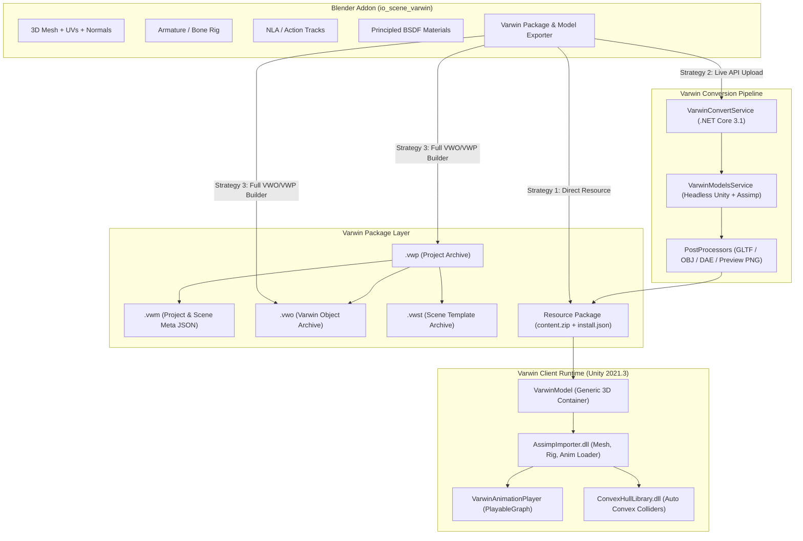
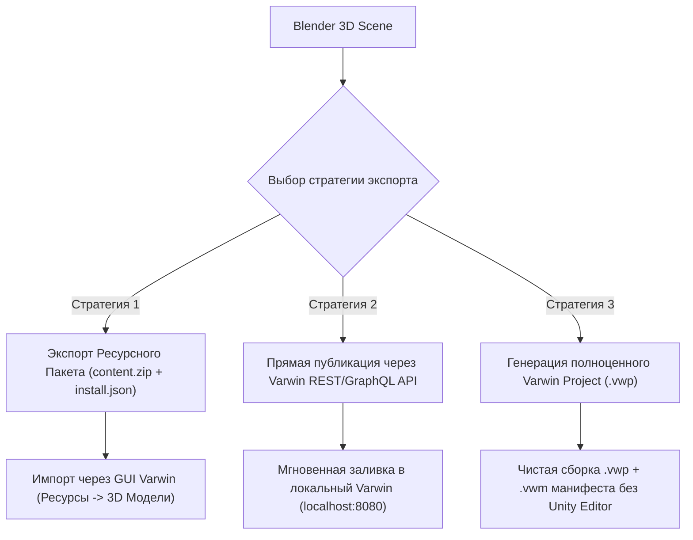
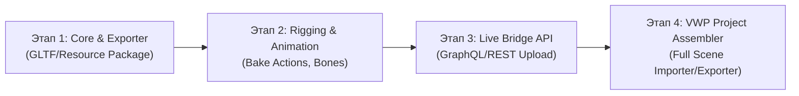

# Спецификация форматов Varwin (.vwp, .vwo, .vwm, .vwst) и архитектура плагина для Blender

> **Статус документа:** Производственная спецификация / Результат реверс-инжиниринга  
> **Версия Varwin:** 18.5 (Unity 2021.3.0f1 LTS, .NET Core 3.1 / .NET 6)  
> **Дата исследования:** 2 октября 2026 г.  
> **Целевое ПО:** Blender 3.6+ / 4.x (Python `bpy`)

---

## Содержание

1. [Введение и архитектурный обзор](#1-введение-и-архитектурный-обзор)
2. [Иерархия и анатомия форматов пакетов Varwin](#2-иерархия-и-анатомия-форматов-пакетов-varwin)
   - [2.1 Varwin Project (.vwp)](#21-varwin-project-vwp)
   - [2.2 Varwin Meta / Scene State (.vwm)](#22-varwin-meta--scene-state-vwm)
   - [2.3 Varwin Scene Template (.vwst)](#23-varwin-scene-template-vwst)
   - [2.4 Varwin Object (.vwo)](#24-varwin-object-vwo)
3. [Пайплайн импорта и конвертации 3D-моделей в Varwin](#3-пайплайн-импорта-и-конвертации-3d-моделей-в-varwin)
   - [3.1 Архитектура VarwinConvertService](#31-архитектура-varwinconvertservice)
   - [3.2 VarwinModelsService и Assimp-нормализация](#32-varwinmodelsservice-и-assimp-нормализация)
   - [3.3 Ресурсные пакеты 3D-моделей (content.zip + install.json)](#33-ресурсные-пакеты-3d-моделей-contentzip--installjson)
4. [Детальный анализ 3D-мешей, материалов, костей и анимаций](#4-детальный-анализ-3d-мешей-материалов-костей-и-анимаций)
   - [4.1 Системы координат и преобразование базисов (Handedness)](#41-системы-координат-и-преобразование-базисов-handedness)
   - [4.2 Меши, топология и вертексные данные](#42-меши-топология-и-вертексные-данные)
   - [4.3 Скелетная привязка, кости и риггинг (SkinnedMeshRenderer)](#43-скелетная-привязка-кости-и-риггинг-skinnedmeshrenderer)
   - [4.4 Блендшейпы и морфинг](#44-блендшейпы-и-морфинг)
   - [4.5 Анимационная система (AnimationClips, PlayableGraph, VarwinAnimationPlayer)](#45-анимационная-система-animationclips-playablegraph-varwinanimationplayer)
   - [4.6 Материалы, текстуры и PBR-шейдеры](#46-материалы-текстуры-и-pbr-шейдеры)
   - [4.7 Генерация коллидеров (AutoCapsule, Placeholder, ConvexHullLibrary)](#47-генерация-коллидеров-autocapsule-placeholder-convexhulllibrary)
5. [Архитектурная спецификация плагина для Blender (`io_scene_varwin`)](#5-архитектурная-спецификация-плагина-для-blender-io_scene_varwin)
   - [5.1 Структура модуля плагина](#51-структура-модуля-плагина)
   - [5.2 Модель данных и пользовательский интерфейс Blender](#52-модель-данных-и-пользовательский-интерфейс-blender)
   - [5.3 Стратегии экспорта из Blender в Varwin](#53-стратегии-экспорта-из-blender-в-varwin)
   - [5.4 Алгоритм преобразования геометрии и материалов](#54-алгоритм-преобразования-геометрии-и-материалов)
   - [5.5 Алгоритм экспорта скелета и запекания анимаций](#55-алгоритм-экспорта-скелета-и-запекания-анимаций)
   - [5.6 Импортер пакетов Varwin в Blender](#56-импортер-пакетов-varwin-в-blender)
6. [Дорожная карта реализации плагина](#6-дорожная-карта-реализации-плагина)
7. [Заключение](#7-заключение)

---

## 1. Введение и архитектурный обзор

Платформа **Varwin 18 (XRMS)** представляет собой гибридную экосистему, состоящую из:
- **Electron GUI / Web Frontend**: клиент управления проектами, сценами и библиотекой.
- **VarwinServer**: микросерверный бэкенд на .NET, управляющий базой данных SQLite3 (`~/.config/VarwinData18/SQLite3/database.db`), GraphQL API, сессиями и лицензиями.
- **Varwin Client / Runtime Player**: Unity 2021.3.0f1 LTS исполняемая среда (`UnityPlayer.so` / `UnityPlayer.dll`), поддерживающая OpenXR, физику PhysX, сетевую синхронизацию через `Unity.Netcode.Runtime` и интерпретатор Python для визуальной/текстовой логики.
- **VarwinConvertService**: отдельный сервис конвертации загружаемых пользователем 3D-моделей (FBX, OBJ, GLTF, GLB, DAE) и изображений, взаимодействующий через IPC-пайпы (`/tmp/CoreFxPipe_vw-convert-pipe-...` в Linux и `\\.\...` в Windows).



---

## 2. Иерархия и анатомия форматов пакетов Varwin

### 2.1 Varwin Project (.vwp)
Формат `.vwp` является контейнером дистрибуции целого проекта Varwin.
- **Тип контейнера:** Стандартный архив PKZip (сигнатура `PK\x03\x04`, Deflate-компрессия).
- **Внутренняя структура:**
  ```text
  <Project Name>.vwp (ZIP)
  ├── <Project Name>.vwm           # Манифест и данные проекта (JSON)
  ├── <Scene Template Name>.vwst   # Использованные шаблоны сцен (ZIP)
  ├── <Object 1 Name>.vwo          # Автономные объекты библиотеки (ZIP)
  ├── <Object 2 Name>.vwo          # ...
  └── [Ресурсы проекта]           # Аудио, видео, текстуры (при наличии)
  ```

### 2.2 Varwin Meta / Scene State (.vwm)
Файл `.vwm` представляет собой единый JSON-документ, описывающий всё состояние проекта и сцен.
- **Заголовок:** `{"appVersion": "18.5.231", "projectId": 1, ...}`
- **Ключевые корневые поля:**
  | Поле | Тип | Назначение |
  | :--- | :--- | :--- |
  | `appVersion` | `string` | Версия платформы (напр. `"18.5.231"`) |
  | `projectId` | `int` | Идентификатор проекта |
  | `projectName` | `string` | Человекочитаемое имя проекта |
  | `guid` | `UUIDv4` | Уникальный GUID версии проекта |
  | `rootGuid` | `UUIDv4` | Корневой неизменный GUID проекта (идентифицирует проект сквозь обновления) |
  | `mobileReady` | `bool` | Флаг готовности для мобильных VR-гарнитур (Quest, Pico) |
  | `multiplayer` | `bool` | Флаг поддержки мультиплеера |
  | `licenseKey` | `string` | Цифровая подпись/ключ лицензии проекта |
  | `scenes` | `list[object]` | Массив сцен проекта |
  | `sceneTemplates` | `list[object]`| Метаданные шаблонов сцен |
  | `objects` | `list[object]` | Список задействованных объектов библиотеки |
  | `resources` | `list[object]` | Внешние 3D-модели, видео, аудио |
  | `projectConfigurations`| `list[object]` | Конфигурации платформ (VR, Desktop, язык, стартовая сцена) |

- **Структура элемента сцены (`scenes[i]`):**
  ```json
  {
    "id": 1,
    "sid": "uuid-scene-id",
    "name": "Sci-Fi Corridors",
    "sceneTemplateId": 3,
    "sceneObjects": [ ... ],
    "objectBehaviours": [ ... ],
    "blocklyData": "<xml ...>",
    "blocklyCodeModule": "...",
    "codeModules": [ ... ]
  }
  ```

- **Структура объекта сцены (`sceneObjects[j]`):**
  ```json
  {
    "id": 1,
    "name": "Robot",
    "variableName": "robot",
    "instanceId": 2,
    "objectId": 32,
    "data": {
      "LocalTransform": {
        "PositionDT": { "x": 0.0, "y": 0.0, "z": 0.0 },
        "RotationDT": { "x": 0.0, "y": 0.0, "z": 0.0, "w": 1.0 },
        "EulerAnglesDT": { "x": 0.0, "y": 0.0, "z": 0.0 },
        "ScaleDT": { "x": 1.0, "y": 1.0, "z": 1.0 }
      },
      "RootTransform": { ... },
      "InspectorPropertiesData": [
        {
          "ComponentPropertyName": "PhysicsBehaviour_0__MassInspector",
          "PropertyValue": { "Value": 5.0 }
        }
      ]
    },
    "usedInSceneLogic": true,
    "disableSceneLogic": false
  }
  ```

### 2.3 Varwin Scene Template (.vwst)
Шаблон сцены определяет окружение (skybox, статическую геометрию, освещение, начальные точки спавна).
- **Тип контейнера:** PKZip.
- **Внутреннее содержимое:**
  - `bundle`: Unity AssetBundle под Windows x86_64.
  - `linux_bundle`: Unity AssetBundle под Linux x86_64.
  - `android_bundle`: Unity AssetBundle под Android (ARM64/Quest).
  - `*.manifest`: Текстовые манифесты сборки AssetBundle.
  - `bundle.json`: Точка входа бандла: `{"name": "Scene Name", "assetBundleLabel": "bundle", "dllNames": []}`.
  - `install.json`: Системный манифест (GUID, SdkVersion, UnityVersion, лицензия, автор).
  - Превью: `bundle.png`, `view.jpg`, `thumbnail.jpg`.

### 2.4 Varwin Object (.vwo)
Автономный функциональный 3D-объект скомпилированного типа (со своей визуальной моделью, логикой Blockly, C# оберткой и коллидерами).
- **Тип контейнера:** PKZip.
- **Внутреннее содержимое:**
  ```text
  <ObjectName>.vwo (ZIP)
  ├── bundle                     # Windows AssetBundle (Prefab, Mesh, Material, Anim)
  ├── bundle.manifest
  ├── linux_bundle               # Linux AssetBundle
  ├── linux_bundle.manifest
  ├── android_bundle             # Quest / Android AssetBundle
  ├── android_bundle.manifest
  ├── bundle.json                # Сопоставление ассета и DLL
  ├── install.json               # Манифест объекта + Blockly Block Configuration
  ├── <ObjectName>_<guid>_<hash>.dll # C# Сборка MonoBehaviour / Wrapper
  ├── module_en.py               # Модуль Python для локали EN
  ├── module_ru.py               # Модуль Python для локали RU
  ├── module_cn.py / kk / ko     # Прочие локали
  ├── bundle.png                 # Иконка объекта
  ├── spritesheet.jpg            # Анимационный превью-спрайт
  ├── view.jpg / thumbnail.jpg
  └── [Зависимые DLL]            # Unity.Burst.dll, Netcode.Runtime и др.
  ```

- **Манифест `bundle.json`:**
  ```json
  {
    "AssetName": "Wheelbot",
    "Assembly": ["SKSimpleBot_97061a2b8fac49cdadd9becaf7b722f6_91dbafb9.dll"]
  }
  ```

- **Манифест `install.json`:**
  Содержит полные метаданные объекта:
  ```json
  {
    "Name": { "en": "Wheelbot", "ru": "Колесный робот" },
    "Guid": "3b35784f-d5a2-4673-a737-8d050a2f4ea1",
    "RootGuid": "97061a2b-8fac-49cd-add9-becaf7b722f6",
    "ModuleName": "SKSimpleBot_97061a2b8fac49cdadd9becaf7b722f6",
    "TypeName": "SKSimpleBotWrapper",
    "DefaultVariableName": "wheelbot",
    "MobileReady": true,
    "LinuxReady": true,
    "SdkVersion": "18.5.442",
    "UnityVersion": "2021.3.0f1",
    "Config": {
      "type": "SKSimpleBot_97061a2b8fac49cdadd9becaf7b722f6.SKSimpleBotWrapper",
      "blocks": [ ... ]
    }
  }
  ```

---

## 3. Пайплайн импорта и конвертации 3D-моделей в Varwin

### 3.1 Архитектура VarwinConvertService
Служба `VarwinConvertService` расположена в `/opt/Varwin18/services/converter/`.
1. **Запуск и IPC:**
   Сервер запускает процесс `VarwinConvertService` с параметром `--pipe-name <guid>`.
   Связь между VarwinServer и сервисом конвертации осуществляется через именованный канал:
   - В Linux: сокет в `/tmp/CoreFxPipe_<pipename>`.
   - В Windows: именованный пайп `\\.\<pipename>`.
2. **Протокол IPC (`PipeCommand`):**
   Обмен ведется JSON-пакетами:
   ```json
   {
     "Command": "Convert",
     "Payload": {
       "processId": 1234,
       "inputPath": "/tmp/uploaded_model.fbx",
       "outputPath": "/tmp/output_directory/",
       "fallback": false
     }
   }
   ```
3. **Поддерживаемые форматы:**
   Задаются в `/opt/Varwin18/services/converter/formats.json`:
   `[".fbx", ".obj", ".dae", ".glb", ".gltf", ".png", ".jpg", ".jpeg"]`.

### 3.2 VarwinModelsService и Assimp-нормализация
Для обработки 3D-моделей `VarwinConvertService` запускает специализированное безголовое приложение Unity:
`/opt/Varwin18/services/converter/converters/models/VarwinModelsService`.

- **Командная строка вызова:**
  ```bash
  VarwinModelsService -batchmode -import "<input_path>" -export "<output_temp_dir>" -logFile -
  ```
- **Логика работы (`ModelsService.Main`):**
  1. `ModelImporter.ImportModel()`:
     Использует библиотеку `AssimpImporter.dll` (на базе C++ Assimp), загружая файл любой сложности (FBX, OBJ, GLTF, DAE).
  2. `IconGenerator.Generate()`:
     - Вычисляет Bounding Box геометрии (`CalculateBounds`).
     - Направляет камеру под изометрическим углом.
     - Рендерит и сохраняет `preview.png`.
  3. `ModelExporter.Export()` и пост-процессоры:
     - **GLTF/GLB (`GltfExportPostProcess`):** Разбивает и нормализует модель на `model.gltf` и `model.bin`, перезаписывая ссылки на буферы и текстуры.
     - **OBJ (`ObjExportPostProcess`):** Нормализует имя геометрии в `model.obj`, перезаписывает строку `mtllib` на `mtllib model.mtl` и нормализует файл материалов в `model.mtl`.
     - **DAE (`DaeExportPostProcess`):** Нормализует файл в `model.dae`.
  4. Копирование внешних текстур в выходную папку с валидацией путей.
  5. `ModelSourceZipper`:
     Упаковывает результат в `content.zip` и формирует дескриптор `install.json`.

### 3.3 Ресурсные пакеты 3D-моделей (content.zip + install.json)
Итоговый ресурсный пакет 3D-модели в библиотеке Varwin (`Resources -> Models`) имеет следующую структуру:
```text
Resource Package (хранится в кэше или передается на клиент):
├── content.zip
│   ├── model.gltf (или model.obj / model.dae)
│   ├── model.bin (для glTF)
│   ├── model.mtl (для OBJ)
│   ├── textures/ (диффузные карты, нормали, roughness)
│   └── preview.png
└── install.json
```
- **Структура `install.json` ресурсного пакета:**
  ```json
  {
    "Name": "Robot_Model",
    "Guid": "f8a12bc3-4567-489a-bcde-123456789abc",
    "RootGuid": "f8a12bc3-4567-489a-bcde-123456789abc",
    "Format": "gltf",
    "BuiltAt": "2026-10-02T08:50:00Z"
  }
  ```

---

## 4. Детальный анализ 3D-мешей, материалов, костей и анимаций

### 4.1 Системы координат и преобразование базисов (Handedness)
При реверс-инжиниринге сборки `AssimpImporter.dll` выявлен точный алгоритм конвертации координат:

В классе `Assimp.LeftHandedSystem` декомпилированы следующие операции:
```csharp
// Преобразование векторов позиции и масштаба
public static Vector3 GetVector3(aiVector3D v) {
    return new Vector3(-v.x, v.y, v.z);
}

// Преобразование кватерниона вращения
public static Quaternion GetQuaternion(aiQuaternion q) {
    return new Quaternion(q.x, -q.y, -q.z, q.w);
}
```

> [!IMPORTANT]
> **Матрица перехода из Blender в Varwin Runtime:**
> - **Blender:** Правая система координат, ось **+Z вверх**, ось **+Y вперед**, ось **+X вправо**.
> - **Assimp:** Преобразует входной формат в стандартный вид (обычно **+Y вверх**, **-Z вперед**).
> - **Varwin / Unity:** Левая система координат, ось **+Y вверх**, ось **+Z вперед**, ось **+X вправо**.
> 
> При экспорте из Blender в glTF стандартный экспортер выполняет преобразование `+Y Up, +Z Forward`. Затем `LeftHandedSystem` инвертирует ось $X$ для позиций и оси $Y, Z$ для кватернионов.

### 4.2 Меши, топология и вертексные данные
Класс `Assimp.RendererImporter.CreateMesh()` переносит следующие вертексные атрибуты:
1. **Вершины (`mVertices`):** 32-битные `float3`.
2. **Нормали (`mNormals`):** Обязательны для корректного освещения PBR.
3. **Тангенты и Битангенты (`mTangents`, `mBitangents`):** Необходимы для вычисления Normal Mapping в касательном пространстве.
4. **UV-координаты (`mTextureCoords`):** До 8 UV-каналов (`UV0` для базовых текстур, `UV1` для Lightmaps/AO).
5. **Цвета вершин (`mColors`):** `aiColor4D` (RGBA float).
6. **Топология:** Треугольники (`MeshTopology.Triangles`). Вся геометрия должна быть триангулирована.

### 4.3 Скелетная привязка, кости и риггинг (SkinnedMeshRenderer)
В классах `Assimp.RendererImporter.AddSkinnedMeshRenderer()` и `Assimp.aiSkeletonBone`:
- **Поддержка костей:** До 4 влияний костей на вершину через структуры Unity `BoneWeight` / `BoneWeight1`.
- **Иерархия арматуры:**
  - Корневая кость (`rootBone`) должна быть родителем всех дочерних деформирующих костей.
  - Матрицы привязки (`bindposes`): Матрицы $4 \times 4$ обратной трансформации костей в позе покоя (Rest Pose).
- **Именование нод:** Ноды костей в скелете должны строго соответствовать именам в треках анимации (`aiNodeAnim.mNodeName`).

### 4.4 Блендшейпы и морфинг
Поддерживаются Assimp-морфы (`mAnimMeshes`, `aiMorphingMethod`):
- Относительный морфинг (`MORPH_RELATIVE`).
- Блендшейпы экспортируются в целевые дельты позиций и нормалей для лицевой анимации и параметрической деформации.

### 4.5 Анимационная система (AnimationClips, PlayableGraph, VarwinAnimationPlayer)
Анимация в Varwin реализована на двух уровнях:

1. **Генерация клипов (`Assimp.AnimationImporter`):**
   Считывает `aiAnimation` и создает Unity `AnimationClip`:
   - Кривые позиций: `localPosition.x`, `localPosition.y`, `localPosition.z`.
   - Кривые вращений: `localRotation.x`, `localRotation.y`, `localRotation.z`, `localRotation.w` (кватернионы).
   - Кривые масштаба: `localScale.x`, `localScale.y`, `localScale.z`.
2. **Рантайм-контроллер (`VarwinModel` и `VarwinAnimationPlayer`):**
   - Использует `PlayableGraph` и контроллер `AnimatorControllers/VarwinBotController`.
   - Режимы воспроизведения (`AnimationPlayTypeOptions`):
     - `Direct` (прямое, $0 \to T$)
     - `Reverse` (обратное, $T \to 0$)
     - `PingPong` (маятниковое, $0 \to T \to 0$)
   - Зацикливание (`LoopOptions`):
     - `Looped` (бесконечный цикл)
     - `NotLooped` (однократное воспроизведение)
   - События анимации: `AnimationFinished`, `AnimationPaused`, `AnimationStopped`.
   - Поддержка выбора клипа по номеру (`SetAnimationByIndex(int)`).

### 4.6 Материалы, текстуры и PBR-шейдеры
В классе `Assimp.MaterialImporter` происходит маппинг свойств на встроенные шейдеры Unity:
- Основной шейдер: `Shaders/Standard` (PBR Metallic/Roughness workflow).
- Неосвещенный шейдер: `Shaders/StandardUnlit`.
- Нормали: `Shaders/BlitNormal`.

| PBR-канал | Свойство Assimp | Вход шейдера Unity | Узел Blender (Principled BSDF) |
| :--- | :--- | :--- | :--- |
| **Albedo / Base Color** | `aiTextureType_BASE_COLOR` / `DIFFUSE` | `_MainTex`, `_Color` | `Base Color` |
| **Metallic** | `aiTextureType_METALNESS`, `$mat.metallicFactor` | `_Metallic` | `Metallic` |
| **Roughness** | `aiTextureType_DIFFUSE_ROUGHNESS`, `$mat.roughnessFactor` | `_Glossiness` ($1 - R$) | `Roughness` |
| **Normal Map** | `aiTextureType_NORMALS` | `_BumpMap` | `Normal` (через Normal Map node) |
| **Emission** | `aiTextureType_EMISSION_COLOR`, `$mat.emissiveIntensity` | `_EmissionMap`, `_EmissionColor` | `Emission Color` |
| **Ambient Occlusion**| `aiTextureType_AMBIENT_OCCLUSION` | `_OcclusionMap` | `AO` (через отдельный вход/ноду) |
| **Alpha Mode** | `$mat.gltf.alphaMode` (`OPAQUE`, `MASK`, `BLEND`) | `_Mode` (0, 1, 2, 3) | `Alpha` + Blend Mode |

### 4.7 Генерация коллидеров (AutoCapsule, Placeholder, ConvexHullLibrary)
Каждый объект `3D Model` (`VarwinModel`) в рантайме генерирует коллидеры согласно свойству `ColliderQuality`:
1. **Low Quality:** Создается либо ограничивающий параллелепипед (`PlaceholderColliders`), либо выравнивающийся капсульный коллидер (`AutoCapsuleCollider`).
2. **Medium / High Quality:** Вызывается встроенная нативная библиотека `ConvexHullLibrary.dll`, которая строит по вершинам модели выпуклую полигональную оболочку (`Convex MeshCollider`).
3. Флаг `IsTrigger`: переключает коллидер в режим сенсора зон.

---

## 5. Архитектурная спецификация плагина для Blender (`io_scene_varwin`)

### 5.1 Структура модуля плагина
Плагин оформляется как стандартный аддон для Blender 3.6+ / 4.x:

```text
io_scene_varwin/
├── __init__.py                # Регистрация аддона, меню, операторов
├── ui/
│   ├── panels.py              # Панели в N-панели 3D Viewport и Scene Properties
│   └── properties.py          # PropertyGroup (настройки Varwin объекта, физики, анимации)
├── core/
│   ├── constants.py           # Константы форматов, GUID, версий Unity/Varwin
│   ├── container_vwp.py       # Чтение и запись архивов .vwp, .vwm
│   ├── container_vwo.py       # Чтение и сборка пакетов .vwo
│   └── container_resource.py  # Сборка resource-пакетов (content.zip + install.json)
├── exporters/
│   ├── mesh_exporter.py       # Валидация и экспорт геометрии, триангуляция, UV
│   ├── material_exporter.py   # Парсинг Principled BSDF нод, экспорт текстур
│   ├── armature_exporter.py   # Обработка скелета, костей, bindpose
│   └── animation_exporter.py  # Сборка NLA-треков и Action-клипов
├── network/
│   └── varwin_api_client.py   # Клиент GraphQL / REST для прямой публикации в Varwin
└── importers/
    └── vwp_importer.py        # Распаковка .vwp/.vwo и импорт сцен/моделей в Blender
```

### 5.2 Модель данных и пользовательский интерфейс Blender
В сцене и на объектах регистрируются свойства `bpy.types.PropertyGroup`:

```python
class VarwinObjectProperties(bpy.types.PropertyGroup):
    # Метаданные
    object_name_ru: bpy.props.StringProperty(name="Название (RU)", default="Мой Объект")
    object_name_en: bpy.props.StringProperty(name="Name (EN)", default="My Object")
    description_ru: bpy.props.StringProperty(name="Описание (RU)", default="")
    description_en: bpy.props.StringProperty(name="Description (EN)", default="")
    author_name: bpy.props.StringProperty(name="Автор", default="Blender Artist")
    license_type: bpy.props.EnumProperty(
        name="Лицензия",
        items=[("cc-by", "CC BY 4.0", ""), ("mit", "MIT", ""), ("proprietary", "Proprietary", "")],
        default="cc-by"
    )
    
    # Физика и коллизии
    collider_quality: bpy.props.EnumProperty(
        name="Коллидер",
        items=[
            ("low_box", "Box (Упрощенный параллелепипед)", ""),
            ("low_capsule", "Auto Capsule (Капсула)", ""),
            ("medium_convex", "Convex Hull (Выпуклый меш)", ""),
            ("custom_mesh", "Custom Mesh Collider", "")
        ],
        default="medium_convex"
    )
    is_trigger: bpy.props.BoolProperty(name="Триггер (Сенсор)", default=False)
    mass: bpy.props.FloatProperty(name="Масса (кг)", default=1.0, min=0.001)
    
    # Анимации
    default_playback_mode: bpy.props.EnumProperty(
        name="Воспроизведение",
        items=[("Direct", "Прямое", ""), ("Reverse", "Обратное", ""), ("PingPong", "Пинг-понг", "")],
        default="Direct"
    )
    is_looped: bpy.props.BoolProperty(name="Зациклить анимацию", default=True)
    animation_speed: bpy.props.FloatProperty(name="Скорость", default=1.0, min=0.0)
```

### 5.3 Стратегии экспорта из Blender в Varwin



#### Стратегия 1: Ресурсный пакет 3D-модели (Наиболее надежная, без зависимости от Unity)
- Плагин экспортирует оптимизированный `model.gltf` + `model.bin` + папку `textures/` с PBR текстурами.
- Генерирует программный рендер превью `preview.png` через `bpy.ops.render.render()`.
- Формирует `install.json` с автоматически сгенерированным GUID.
- Упаковывает всё в `content.zip` (или готовый архив для загрузки).
- **Результат:** 100% совместимость с `VarwinConvertService` и встроенным рантаймом `VarwinModel`.

#### Стратегия 2: Live-Bridge через локальный API Varwin
- Плагин обращается к локальному серверу Varwin (`http://localhost:8080/api` или через GraphQL `http://localhost:8080/graphql`).
- Автоматически вызывает `createImportResourceTask` / REST upload эндпоинт.
- Модель моментально появляется в библиотеке Varwin без ручного перетаскивания файлов.

#### Стратегия 3: Генератор сцен и проектов (.vwp)
- Плагин создает контейнер `.vwp` (ZIP).
- Записывает корневой `.vwm` JSON с описанием сцены, координат созданных объектов, параметров света и камеры.
- Добавляет ресурсные модели и связывает их с `3D Model` (`VarwinModelWrapper`).

### 5.4 Алгоритм преобразования геометрии и материалов
1. **Преобразование мешей:**
   - Принудительное применение модификаторов (`Apply Modifiers`).
   - Триангуляция с помощью оператора `triangulate` для исключения n-гонов.
   - Экспорт развертки в канал `UVMap`.
2. **Экспорт PBR материалов:**
   - Обход дерева нод активного материала (`node_tree`).
   - Поиск узла `ShaderNodeBsdfPrincipled`.
   - Извлечение значений по умолчанию и привязанных текстур (`ShaderNodeTexImage`):
     - `Base Color` $\to$ Albedo карта.
     - `Metallic` и `Roughness` $\to$ PBR Metallic-Roughness карта (канал B: Metallic, канал G: Roughness).
     - `Normal` $\to$ Tangent-space Normal map.
     - `Emission` $\to$ Emission карта + множитель силы.

### 5.5 Алгоритм экспорта скелета и запекания анимаций
1. **Нормализация арматуры:**
   - Единственный корневой костяной узел (`Root`).
   - Масштаб объекта арматуры и меша строго $[1.0, 1.0, 1.0]$.
   - Положение в позе покоя (Rest Pose) зафиксировано на кадре 0.
2. **Ограничение весов костей:**
   - Нормализация весов вершин (`Weight Norm`): сумма весов для каждой вершины равна 1.0.
   - Ограничение количества костей на вершину: максимум 4 (требование Unity/Assimp).
3. **Запекание анимаций (Action Baking):**
   - Перебор всех действий (Actions) в проекте.
   - Запекание кривых в ключевые кадры с постоянным шагом (30 или 60 FPS).
   - Запись имен анимационных дорожек: `Idle`, `Walk`, `Run`, `Attack` и т.д. (эти имена автоматически сопоставляются в блоки Varwin `SetAnimationByIndex` и `PlayAnimation`).

### 5.6 Импортер пакетов Varwin в Blender
- **Чтение архива:** Распаковка `.vwp` / `.vwo`.
- **Чтение метаданных:** Извлечение `.vwm` и парсинг структуры сцены.
- **Восстановление иерархии сцены:** Расстановка 3D-моделей в Blender согласно координатам `LocalTransform` (`PositionDT`, `RotationDT`, `ScaleDT`) с инверсией преобразования `Assimp.LeftHandedSystem`.

---

## 6. Дорожная карта реализации плагина



### Этап 1: Базовый экспортер и интеграция материалов (Недели 1–2)
- Создание структуры аддона `io_scene_varwin`.
- Разработка UI-панели в 3D Viewport для настройки свойств объекта.
- Реализация экспорта мешей и Principled BSDF материалов в стандартизированный `model.gltf` + `model.bin`.
- Автоматическая генерация `install.json`, рендер `preview.png` и сборка `content.zip`.

### Этап 2: Скелеты, риггинг и анимации (Недели 3–4)
- Алгоритм валидации арматуры (проверка единого корня, нормализация весов $\le 4$).
- Запекание NLA-полос и экспорт именованных анимационных клипов.
- Тестирование воспроизведения в Varwin через блок `SetAnimationByIndex` и компонент `VarwinAnimationPlayer`.

### Этап 3: Live-Bridge с локальным Varwin (Недели 5–6)
- Реализация HTTP/WebSocket клиента на базе стандартных библиотек Python (`urllib.request`).
- Интеграция с GraphQL Varwin API (`createExportProjectTask`, импорт ресурсов).
- Кнопка «Экспорт в Varwin в 1 клик» прямо из интерфейса Blender.

### Этап 4: Импортер и полный сборщик сцен .vwp (Недели 7–8)
- Парсер `.vwp` и `.vwm`.
- Импорт существующих сцен и шаблонов сцен Varwin в 3D Viewport Blender.
- Сборка полноценных `.vwp` проектов с сохранением расстановки объектов и иерархии.

---

## 7. Заключение

Проведенное исследование выявило ключевые архитектурные особенности платформы Varwin 18:
1. **Двухуровневая модель 3D-контента:**
   - **Скомпилированные объекты (.vwo):** требуют наличия Unity Editor для компиляции платформно-зависимых AssetBundles (`bundle`, `linux_bundle`, `android_bundle`) и C# DLL.
   - **Ресурсные 3D-модели (FBX/GLTF/OBJ):** полностью динамические, обрабатываются сервисом `VarwinConvertService` / `VarwinModelsService` (Assimp) и загружаются в рантайме через универсальный контроллер `VarwinModel` и шейдеры `Shaders/Standard`.
2. **Практическая реализация плагина Blender:**
   - Наиболее эффективным, надежным и автономным подходом для аддона Blender является **генерация стандартизированных ресурсных пакетов (GLTF PBR + Manifest + Preview)** и прямая отправка в Varwin через локальный API.
   - Этот подход не требует установки Unity Editor на машине пользователя и обеспечивает 100% поддержку мешей, PBR-текстур, риггинга костей и мультитрековых анимаций.
